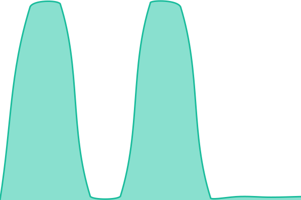

# [📈 Live Status](https://uptime.cinte.cc): <!--live status--> **🟩 All systems operational**

This repository contains the open-source uptime monitor and status page for [ANONSENSEBOT](https://uptime.cinte.cc), powered by [Upptime](https://github.com/upptime/upptime).

With [Upptime](https://upptime.js.org), you can get your own unlimited and free uptime monitor and status page, powered entirely by a GitHub repository. We use [Issues](https://github.com/ANONSENSEBOT/uptime/issues) as incident reports, [Actions](https://github.com/ANONSENSEBOT/uptime/actions) as uptime monitors, and [Pages](https://uptime.cinte.cc) for the status page.

<!--start: status pages-->
<!-- This summary is generated by Upptime (https://github.com/upptime/upptime) -->
<!-- Do not edit this manually, your changes will be overwritten -->
<!-- prettier-ignore -->
| URL | Status | History | Response Time | Uptime |
| --- | ------ | ------- | ------------- | ------ |
|  [Cinte's Blog](https://blog.cinte.cc) | 🟩 Up | [cinte-s-blog.yml](https://github.com/ANONSENSEBOT/uptime/commits/HEAD/history/cinte-s-blog.yml) | 

 194ms
     
 | 

<a href="https://uptime.cinte.cc/history/cinte-s-blog">100.00%</a>
    

|  [RSSHUB](https://rsshub.cinte.cc) | 🟩 Up | [rsshub.yml](https://github.com/ANONSENSEBOT/uptime/commits/HEAD/history/rsshub.yml) | 

 2392ms
     
 | 

<a href="https://uptime.cinte.cc/history/rsshub">98.11%</a>
    

|  [FFXIVBOT for Migang](https://bot.cinte.cc) | 🟩 Up | [ffxivbot-for-migang.yml](https://github.com/ANONSENSEBOT/uptime/commits/HEAD/history/ffxivbot-for-migang.yml) | 

 633ms
     
 | 

<a href="https://uptime.cinte.cc/history/ffxivbot-for-migang">82.93%</a>
    

|  [Migang Image Bed](https://image.cinte.cc) | 🟩 Up | [migang-image-bed.yml](https://github.com/ANONSENSEBOT/uptime/commits/HEAD/history/migang-image-bed.yml) | 

 428ms
     
 | 

<a href="https://uptime.cinte.cc/history/migang-image-bed">89.28%</a>
    

|  [闪耀暖暖API](https://api.sunuannuan.com/api/assets?category=nikki) | 🟩 Up | [api.yml](https://github.com/ANONSENSEBOT/uptime/commits/HEAD/history/api.yml) | 

 257ms
     
 | 

<a href="https://uptime.cinte.cc/history/api">98.17%</a>
    

<!--end: status pages-->

[**Visit our status website →**](https://uptime.cinte.cc)

## 📄 License

- Powered by: [Upptime](https://github.com/upptime/upptime)
- Code: [MIT](./LICENSE) © [ANONSENSEBOT](https://uptime.cinte.cc)
- Data in the `./history` directory: [Open Database License](https://opendatacommons.org/licenses/odbl/1-0/)
